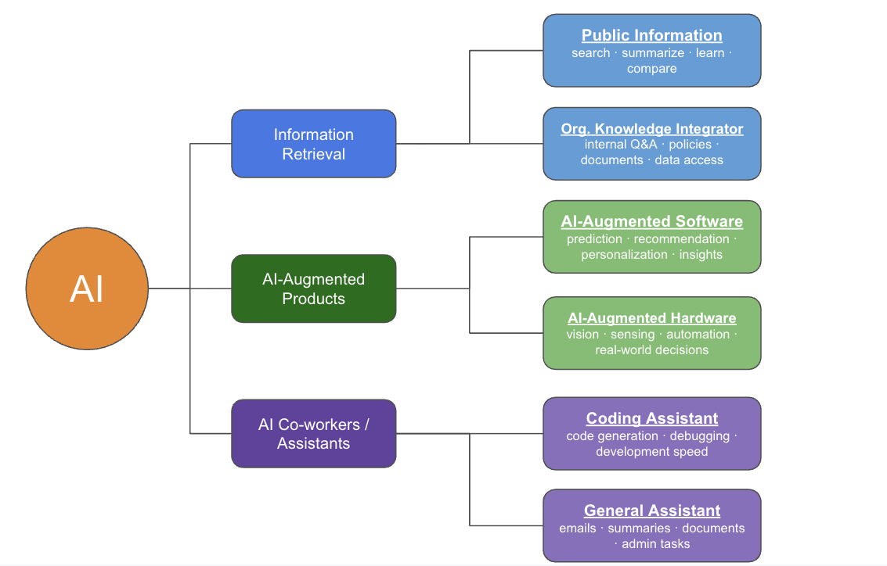

# AI Use Case Landscape (as of 2026 April)

This article provides an overview of the AI use case landscape as of April 2026, highlighting key applications and trends in the field of artificial intelligence.

## AI Use Case Categorization (2026)

<table style="border-collapse: collapse; width: 100%;">
    <thead>
    <tr>
        <th>Category</th>
        <th>Subcategory</th>
        <th>Typical User</th>
        <th>Purpose &amp; Use Cases</th>
    </tr>
    </thead>
    <tbody>
    <tr>
        <td class="category" rowspan="2">Information Retrieval</td>
        <td class="subcategory">Public Specialized Information Retriever</td>
        <td class="user">Everyone: employees, students, researchers, general users</td>
        <td class="purpose">
        Purpose:
        Quickly access, summarize, compare, and understand external information. 
        Use cases:
        Research support, concept explanation, article summarization, market scanning, idea generation, and question answering.
        </td>
    </tr>
    <tr>
        <td class="subcategory">Organizational Knowledge Integrator</td>
        <td class="user">Internal employees, analysts, managers, operations teams</td>
        <td class="purpose">
        Purpose:
        Retrieve and unify internal knowledge across documents, policies, databases, and workflows. 
        Use cases:
        Internal Q&amp;A, policy lookup, onboarding support, enterprise search, operational guidance, and decision reference across systems.
        </td>
    </tr>
    <tr>
        <td class="category" rowspan="2">AI-Augmented Products</td>
        <td class="subcategory">AI-Augmented Software</td>
        <td class="user">Product teams, data scientists, business users, end-users of AI-enabled applications</td>
        <td class="purpose">
        Purpose:
        Embed AI into software products to enhance intelligence, responsiveness, and value delivery. 
        Use cases:
        Recommendation engines, intelligent dashboards, forecasting tools, personalization features, conversational interfaces, and NLP-driven software functions.
        </td>
    </tr>
    <tr>
        <td class="subcategory">AI-Augmented Hardware</td>
        <td class="user">IoT teams, robotics teams, device manufacturers, operators of smart equipment</td>
        <td class="purpose">
        Purpose:
        Embed AI into physical systems for perception, automation, and real-world decision support. 
        Use cases:
        Smart devices, robotics, computer vision in manufacturing, edge AI sensors, autonomous inspection, and device-side anomaly detection.
        </td>
    </tr>
    <tr>
        <td class="category" rowspan="2">AI Co-workers / Productivity Assistants</td>
        <td class="subcategory">Coding Assistant</td>
        <td class="user">Developers, ML engineers, data scientists, technical product teams</td>
        <td class="purpose">
        Purpose:
        Improve software development productivity, speed, and code quality. 
        Use cases:
        Code generation, debugging, refactoring, test writing, API integration, documentation drafting, and system design assistance.
        </td>
    </tr>
    <tr>
        <td class="subcategory">General Productivity Assistant</td>
        <td class="user">Knowledge workers, managers, operations teams, business support functions</td>
        <td class="purpose">
        Purpose:
        Reduce repetitive cognitive work and improve day-to-day administrative efficiency. 
        Use cases:
        Email drafting, meeting summaries, report writing, content review, translation, presentation support, and routine text-based administrative work.
        </td>
    </tr>
    </tbody>
</table>

## Business & Strategic Analysis
<table style="border-collapse: collapse; width: 100%;">
    <thead>
    <tr>
        <th>Category</th>
        <th>Subcategory</th>
        <th>Complexity</th>
        <th>Utility</th>
        <th>Prioritization</th>
    </tr>
    </thead>
    <tbody>
    <tr>
        <td class="category" rowspan="2">Information Retrieval</td>
        <td class="subcategory">Public Information Retriever</td>
        <td class="user">Low setup · no infra · API-based · minimal integration</td>
        <td class="purpose">Very high · daily usage · broad applicability · individual productivity</td>
        <td class="purpose">Immediate win · low cost · org-wide rollout</td>
    </tr>
    <tr>
        <td class="subcategory">Organizational Knowledge Integrator</td>
        <td class="user">Medium–high · RAG setup · data cleaning · access control · integration with systems</td>
        <td class="purpose">High · improves internal efficiency · reduces knowledge friction · better decisions</td>
        <td class="purpose">High priority · requires planning · start with key domains</td>
    </tr>
    <tr>
        <td class="category" rowspan="2">AI-Augmented Products</td>
        <td class="subcategory">AI-Augmented Software</td>
        <td class="user">High · model integration · product redesign · continuous tuning</td>
        <td class="purpose">Very high · core product value · differentiation · revenue impact</td>
        <td class="purpose">Strategic priority · product-driven · phased implementation</td>
    </tr>
    <tr>
        <td class="subcategory">AI-Augmented Hardware</td>
        <td class="user">Very high · hardware + AI integration · edge constraints · long dev cycle</td>
        <td class="purpose">Medium–high · niche but powerful · operational impact · automation gains</td>
        <td class="purpose">Selective priority · use-case driven · longer ROI horizon</td>
    </tr>
    <tr>
        <td class="category" rowspan="2">AI Co-workers / Productivity Assistants</td>
        <td class="subcategory">Coding Assistant</td>
        <td class="user">Low–medium · tool adoption · minimal infra · dev workflow integration</td>
        <td class="purpose">Very high · immediate productivity gain · faster delivery · better code quality</td>
        <td class="purpose">Immediate adoption · high ROI · developer-first rollout</td>
    </tr>
    <tr>
        <td class="subcategory">General Productivity Assistant</td>
        <td class="user">Low · easy deployment · SaaS tools · minimal integration</td>
        <td class="purpose">High · time-saving · reduces admin workload · broad employee impact</td>
        <td class="purpose">Quick win · org-wide enablement · governance needed</td>
    </tr>
    </tbody>
</table>

## Technological and Practical Implications
<table style="border-collapse: collapse; width: 100%;">
    <thead>
    <tr>
        <th>Category</th>
        <th>Subcategory</th>
        <th>Technical Challenges</th>
        <th>Infrastructure</th>
        <th>Security</th>
    </tr>
    </thead>
    <tbody>
    <tr>
        <td class="category" rowspan="2">Information Retrieval</td>
        <td class="subcategory">Public Specialized Information Retriever</td>
        <td class="user">Prompt reliability · hallucination control · context limitation · API dependency</td>
        <td class="purpose">Cloud LLM APIs · minimal backend · optional caching · UI layer</td>
        <td class="purpose">Data leakage · prompt injection · output validation</td>
    </tr>
    <tr>
        <td class="subcategory">Organizational Knowledge Integrator</td>
        <td class="user">RAG design · data cleaning · retrieval accuracy · system integration · access control</td>
        <td class="purpose">Vector DB · embedding pipeline · document ingestion · API layer · enterprise integration</td>
        <td class="purpose">Sensitive data exposure · RBAC · data isolation · audit logging</td>
    </tr>
    <tr>
        <td class="category" rowspan="2">AI-Augmented Products</td>
        <td class="subcategory">AI-Augmented Software</td>
        <td class="user">Model integration · feature engineering · model drift · latency constraints · evaluation complexity</td>
        <td class="purpose">ML pipelines · model hosting · feature store · monitoring · scalable backend</td>
        <td class="purpose">Model bias · explainability · data privacy · adversarial inputs</td>
    </tr>
    <tr>
        <td class="subcategory">AI-Augmented Hardware</td>
        <td class="user">Edge constraints · model compression · sensor integration · real-world reliability</td>
        <td class="purpose">Edge devices · on-device inference · IoT pipelines · hardware-software integration</td>
        <td class="purpose">Physical risks · adversarial attacks · device security · data integrity</td>
    </tr>
    <tr>
        <td class="category" rowspan="2">AI Co-workers / Productivity Assistants</td>
        <td class="subcategory">Coding Assistant</td>
        <td class="user">Codebase context understanding · hallucinated code · version compatibility · IDE integration</td>
        <td class="purpose">IDE plugins · LLM APIs · local context retrieval · lightweight backend</td>
        <td class="purpose">Code leakage · insecure generation · dependency risks</td>
    </tr>
    <tr>
        <td class="subcategory">General Productivity Assistant</td>
        <td class="user">Context relevance · multi-step reasoning · output consistency · intent ambiguity</td>
        <td class="purpose">SaaS tools · LLM APIs · workflow integration · light orchestration</td>
        <td class="purpose">Sensitive content exposure · prompt injection · governance · misuse risks</td>
    </tr>
    </tbody>
</table>