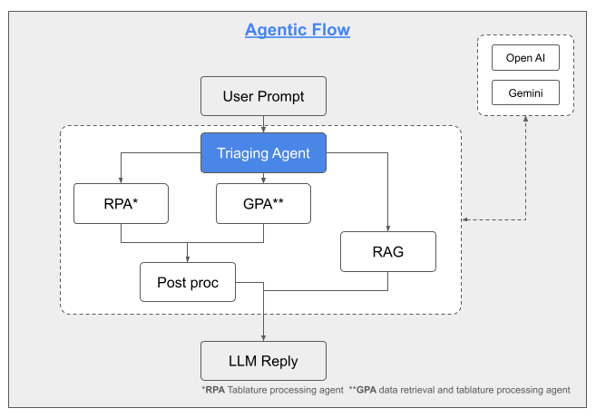

# Agentic Chatbot for Recruitment (Headhunters & Hiring Managers)

## Problem Statement
- Repetitive HR and recruitment-related queries require manual handling, reducing efficiency.
- Limited ability to dynamically extract and analyze data from job descriptions, project tables, and repositories.

## Solution Design
- Agentic workflow to triage and route queries based on intent.
- Generic factual queries handled via structured knowledge retrieval.
- Data-driven queries converted into executable queries for data extraction and analysis across multiple sources.
- Guardrail agent to ensure responses remain aligned with intended use and constraints.

## Tech Stack
- LLM & Orchestration: RAG (Retrieval-Augmented Generation), LangGraph
- Deployment Exploration:
  - GCP VM (baseline deployment)
  - Minikube (local Kubernetes testing)
  - GKE (managed Kubernetes cluster)
  - Vertex AI (managed AI platform)

## Future Applicability
- The exploration provided a range of deployment strategies, enabling flexible selection of optimal production environments.
- It ensures readiness to coordinate across stakeholders and infrastructure, aligning technical choices with future business demands.

## Relevant AI Use Case Category
<table style="border:1px solid gray; border-collapse: collapse;">
  <tr>
    <th style="border:1px solid gray;">Information Search</th>
    <th style="border:1px solid gray;">AI Augmented Product</th>
    <th style="border:1px solid gray;">AI Coworker</th>
  </tr>
  <tr>
    <td style="border:1px solid gray; text-align: center;">✓</td>
    <td style="border:1px solid gray; text-align: center;">✓</td>
    <td style="border:1px solid gray; text-align: center;">✓</td>
  </tr>
</table>

## Github Repository
- [Agentic-AI-Multi-Deployment-Architecture](https://github.com/Alexxbyou/Agentic-LLM)

## Knowledge Graph

