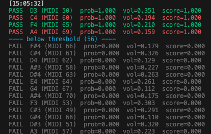

# Deep Learning - Audio Processing Model for Polyphonic Pitch Detection

## Overview
- This project focuses on building a deep learning-based audio processing model for polyphonic pitch detection from audio signals.
- The solution is designed for semi-real-time use cases, targeting higher prediction accuracy with an acceptable latency of around 200ms.
- It is intended for applications where multiple simultaneous notes need to be identified together with their relative strengths.

## Solution Design
- Develop a deep learning-based audio processing model for polyphonic pitch detection, targeting semi-real-time applications with an acceptable latency of **~200ms**.
- Input audio is downsampled to **8kHz** to reduce computational complexity while retaining sufficient frequency information for pitch detection.
- Model architecture combines convolutional layers and GRU layers:
  - **Convolutional layers** extract spectral features from raw audio, similar in function to traditional STFT or resonator-based methods.
  - **GRU** layers capture temporal dependencies across audio frames, enabling more stable and context-aware predictions.
- The model outputs:
  - Probability of existence for each **pitch**
  - **Volume** (amplitude) estimation for each pitch
- Supports prediction across 66 pitch classes, covering a wide musical range from low to high frequencies.
- Designed to balance accuracy and efficiency, making it suitable for real-time or interactive audio applications.

## Tech Stack
- Python 3.12
- PyTorch

## Demo

## AI Use Case Category

<table style="border:1px solid gray; border-collapse: collapse;">
  <tr>
    <th style="border:1px solid gray;">Information Search</th>
    <th style="border:1px solid gray;">AI Augmented Product</th>
    <th style="border:1px solid gray;">AI Coworker</th>
  </tr>
  <tr>
    <td style="border:1px solid gray; text-align: center;">✓</td>
    <td style="border:1px solid gray; text-align: center;">✓</td>
    <td style="border:1px solid gray; text-align: center;">✓</td>
  </tr>
</table>