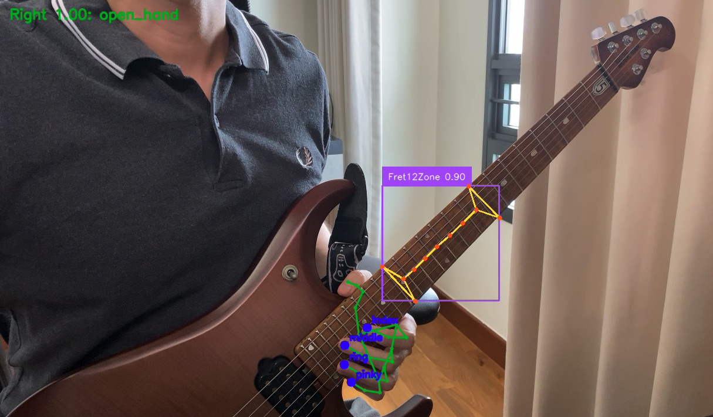

# Deep Learning - Video Processing Model

## Overview
- This project focuses on building a deep learning-based video processing model to detect guitar fretboard keypoints and hand positions from video input.
- The solution serves as an intermediate component that can be integrated with audio processing models to form a comprehensive multi-modal system for automated signal processing and video analysis.
- It is designed for real-time or near real-time applications, enabling live tagging and interpretation of video streams.

## Solution Design
- Utilize a fine-tuned **YOLO pose model** for detecting fretboard keypoints from video frames:
  - **Keypoints** include structural regions of the fretboard to enable accurate spatial understanding.
  - **Data augmentation** techniques are applied to maximize performance given limited training data.
- Use **CVAT** for data preparation and labeling:
  - Supports keypoint (**skeleton**) labeling and positional annotations.
  - Enables efficient creation of training and validation datasets for supervised learning.
- Integrate hand keypoint detection using out-of-the-box **MediaPipe** models:
  - Provides robust and efficient detection of hand positions without the need for custom training.
- Combine outputs from both models:
  - YOLO model (fretboard keypoints)
  - MediaPipe model (hand keypoints)
- Develop a **lightweight application** pipeline to process video streams in **real time**:
  - Perform frame-by-frame inference
  - Overlay and tag detected keypoints directly on video feed
- The combined system enables structured understanding of both instrument and player interaction, forming the basis for downstream analysis or integration with audio models.

## Tech Stack
- Python 3.12
- YOLOv11 Pose Model
- MediaPipe
- CVAT

## Demo

## AI Use Case Category

<table style="border:1px solid gray; border-collapse: collapse;">
  <tr>
    <th style="border:1px solid gray;">Information Search</th>
    <th style="border:1px solid gray;">AI Augmented Product</th>
    <th style="border:1px solid gray;">AI Coworker</th>
  </tr>
  <tr>
    <td style="border:1px solid gray; text-align: center;">✓</td>
    <td style="border:1px solid gray; text-align: center;">✓</td>
    <td style="border:1px solid gray; text-align: center;">✓</td>
  </tr>
</table>