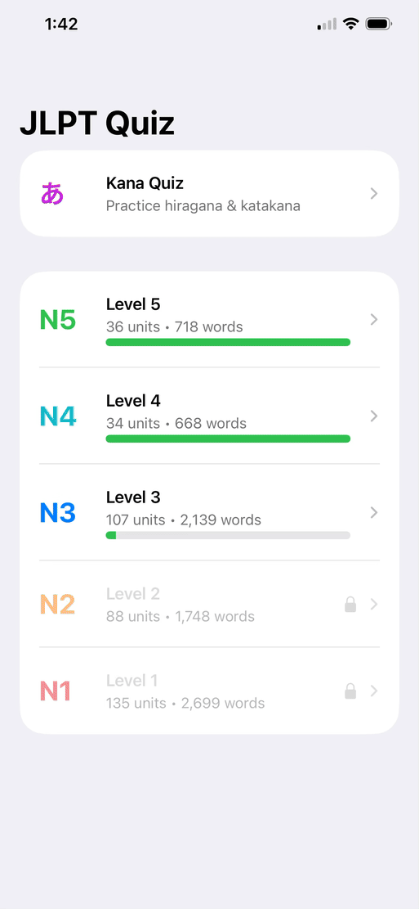

# JLPT Vocabulary Flash Card iOS App

## Problem Statement
- Existing JLPT vocabulary lists are often fragmented and lack structured organization for effective memorization.
- Vocabulary is not systematically grouped by word type (e.g., kanji, native Japanese words, katakana).
- Limited support for learning based on semantic similarity (e.g., topics like food, travel) and pronunciation similarity.
- A need for a customizable and structured vocabulary system to improve retention and learning efficiency.

## Solution Design
- Group vocabulary based on pronunciation similarity and semantic meaning to enhance associative learning.
- Organize vocabulary hierarchically by topic (e.g., nature, travel) and word type (kanji, hiragana-based, katakana).
- Develop an iOS application with structured flashcards and multiple-choice quizzes to reinforce memorization at unit level.

## Tech Stack
- NLP & Embeddings: Natural Language Processing, OpenAI Embeddings
- Integration: API calls for data processing and retrieval
- Application: iOS App Development (Swift / SwiftUI)
- Development Support: Claude Code, OpenAI Codex

## Future Applicability
- Demonstrates how machine learning models and advanced analytical methods can be integrated into end-user applications.
- Highlights the potential of application-based interfaces to improve user engagement and accelerate adoption of proof-of-concept solutions.

## Relevant AI Use Case Category
<table style="border:1px solid gray; border-collapse: collapse;">
  <tr>
    <th style="border:1px solid gray;">Information Search</th>
    <th style="border:1px solid gray;">AI Augmented Product</th>
    <th style="border:1px solid gray;">AI Coworker</th>
  </tr>
  <tr>
    <td style="border:1px solid gray; text-align: center;">✓</td>
    <td style="border:1px solid gray; text-align: center;">✓</td>
    <td style="border:1px solid gray; text-align: center;">✓</td>
  </tr>
</table>

## Github Repository
- [JLPT-Vocab](https://github.com/Alexxbyou/JLPT-Vocab)

## Demo

